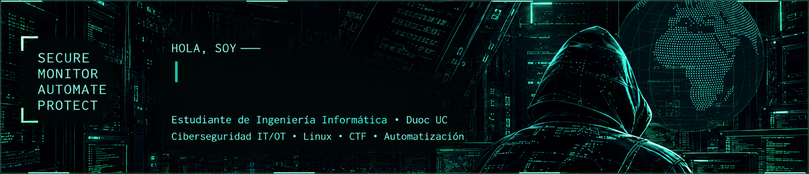
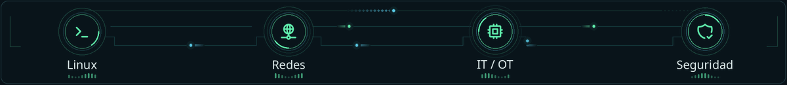
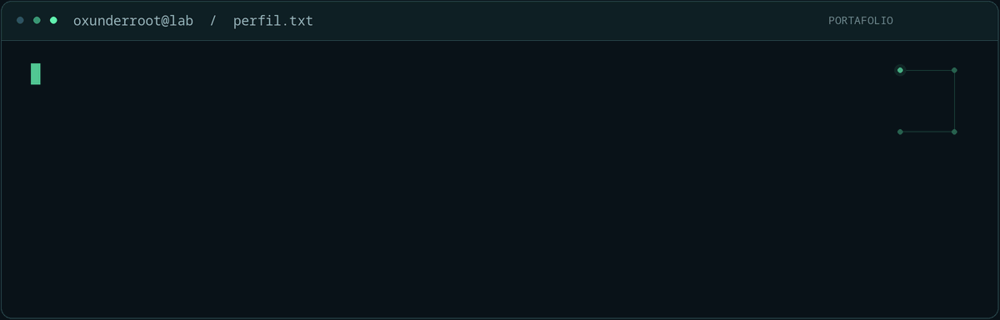
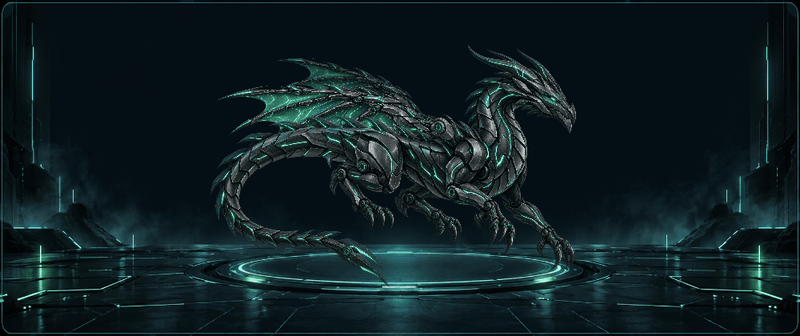

<picture>
  <source media="(max-width: 1000px)" srcset="./assets/banner-planet-mobile.gif" />
  
</picture>

<picture>
  <source media="(prefers-reduced-motion: reduce) and (max-width: 1000px)" srcset="./assets/network-mobile.png" />
  <source media="(prefers-reduced-motion: reduce)" srcset="./assets/network.png" />
  <source media="(max-width: 1000px)" srcset="./assets/network-mobile.gif" />
  
</picture>

<picture>
  <source media="(prefers-reduced-motion: reduce) and (max-width: 1000px)" srcset="./assets/dashboard-mobile.svg" />
  <source media="(prefers-reduced-motion: reduce)" srcset="./assets/dashboard.svg" />
  <source media="(max-width: 1000px)" srcset="./assets/dashboard-mobile-animated.svg" />
  
</picture>

  
  
  

Santiago, Chile · <a href="mailto:sebastianporma.campos@gmail.com">sebastianporma.campos@gmail.com</a>

<strong>Trayectoria completa, proyectos y certificaciones</strong>

## Hola, soy Sebastián

**Estudiante de Ingeniería Informática en Duoc UC, sede San Joaquín, en la etapa final de la carrera.** Mi foco está en la ciberseguridad IT/OT, el hacking ético en entornos autorizados y la automatización. Me gusta entender cómo funcionan los sistemas, construir laboratorios y compartir lo aprendido.

He colaborado en ejercicios de simulación de infraestructura crítica de **CTF Llaitún**, desarrollado soluciones con **Linux, Docker, Raspberry Pi, ESP32 y AWS**, y realizado ayudantías en el **CITT de Duoc UC**, capacitando paso a paso a docentes y estudiantes.

> **Busco una oportunidad laboral en ciberseguridad junior, SOC N1, infraestructura o automatización.** Me interesa aportar a un equipo de forma estable mientras finalizo mis estudios.

## Experiencia aplicada

<table>
<tr>
<td width="50%" valign="top">
<h3>01 · Ciberseguridad IT/OT</h3>
<strong>CTF Llaitún · Colaboración técnica desde Duoc UC</strong>

Diseño e implementación de desafíos en ejercicios de simulación vinculados a CiberLab UC y el Ejército de Chile: OT Warrior, Water Shield y FIDAE.

Entornos virtualizados, servicios vulnerables en laboratorios, Raspberry Pi, ESP32 y Modbus TCP.

</td>
<td width="50%" valign="top">
<h3>02 · Formación y comunidad</h3>
<strong>Alumno ayudante · CITT, Duoc UC</strong>

Capacitación a docentes y estudiantes en ciberseguridad y hacking ético, con acompañamiento paso a paso en ejercicios prácticos.

En <strong>Cyb4Students</strong>, creación de desafíos y apoyo en la plataforma e infraestructura de CTF All Stars 2026.

</td>
</tr>
<tr>
<td width="50%" valign="top">
<h3>03 · Desarrollo y seguridad</h3>
<strong>VOXTI Tecnologías Labs SpA</strong>

Desarrollo de soluciones web con React, TypeScript, APIs REST y PostgreSQL/Supabase.

Controles de seguridad de aplicaciones: MFA/TOTP, JWT, validación de entradas y protección CSRF. Colaboración en soluciones de atención telefónica con IA.

</td>
<td width="50%" valign="top">
<h3>04 · Automatización</h3>
<strong>Voluntariado tecnológico · Teletón</strong>

Desarrollo colaborativo de dashboards y automatización de procesos con Blue Prism.

Levantamiento de requerimientos, documentación técnica y coordinación de tareas con Jira.

</td>
</tr>
</table>

## Herramientas y tecnologías

| Área | Experiencia y conocimientos |
| :--- | :--- |
| **Ciberseguridad** | Enumeración de servicios, análisis de vulnerabilidades, Nmap, diseño de CTF y análisis de phishing. Fundamentos SOC/SIEM y OWASP Top 10. |
| **Infraestructura y redes** | Linux, Docker, virtualización, TCP/IP, DNS, HTTP/HTTPS y Modbus TCP. |
| **Desarrollo y automatización** | Python, Bash, JavaScript, TypeScript, React, APIs REST, SQL, Git/GitHub, Blue Prism y Jira. |
| **Cloud e IoT** | AWS IoT Core, Lambda, S3, DynamoDB, MQTT/TLS, ESP32, Raspberry Pi y Vercel. |

## Proyectos destacados

### [`nmap-pretty`](https://github.com/Sebastian-p-c/nmap-pretty) · Bash / Nmap
Herramienta para estructurar y visualizar los resultados de Nmap por puerto, estado, protocolo y servicio, con exportación a JSON. Pensada para facilitar el análisis en laboratorios, auditorías autorizadas y CTF.

### Medidor inteligente de agua · IoT / AWS
Prototipo con ESP32-CAM, MQTT sobre TLS, AWS IoT Core y Lambda; almacenamiento de imágenes y lecturas en S3/DynamoDB y reconocimiento de texto para automatizar la lectura de medidores.

### Desafíos de infraestructura crítica · IT/OT / Laboratorios
Escenarios de entrenamiento con Modbus TCP, semáforos, dispositivos embebidos, Docker y entornos virtualizados. Enfoque en la relación entre ciberseguridad y sistemas físicos, dentro de ejercicios controlados.

## Tres primeros lugares

| Reconocimiento | Trabajo destacado |
| :--- | :--- |
| **1.er lugar · ChronosCTF** | Competencia de ciberseguridad en Duoc UC, sede Apoquindo, con el equipo **DevSec**. |
| **1.er lugar · Desafío de Innovación Entel 5G** | 4.º SummIT 5G: solución de eficiencia hídrica y lectura inteligente de medidores. |
| **1.er lugar · Botathon Duoc UC–Teletón** | Dashboard y automatización RPA con el equipo **Los 4 Fantásticos**. |

## Certificaciones y formación

- **Ethical Hacking Professional Certification (CEHPC)** — CertiProf.
- **Pentester Mentor Junior (PMJ Certified)** — HackerMentor.
- **Phishing Analyzer** — LetsDefend.
- **Administración de Servidores Linux: Manejo de Recursos** — Platzi.

## Conversemos

**Santiago, Chile** · [sebastianporma.campos@gmail.com](mailto:sebastianporma.campos@gmail.com)  
[LinkedIn](https://www.linkedin.com/in/sebasti%C3%A1n-fernando-porma-campos/) · [Proyecto público: nmap-pretty](https://github.com/Sebastian-p-c/nmap-pretty)

<picture>
  <source media="(prefers-reduced-motion: reduce) and (max-width: 1000px)" srcset="./assets/terminal-mobile.png" />
  <source media="(prefers-reduced-motion: reduce)" srcset="./assets/terminal-v2.png" />
  <source media="(max-width: 1000px)" srcset="./assets/terminal-mobile.gif" />
  
</picture>

<picture>
  <source media="(max-width: 1000px)" srcset="./assets/dragon-tech-mobile.gif" />
  
</picture>
